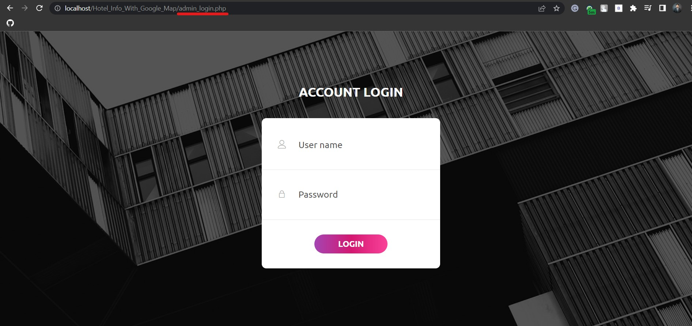
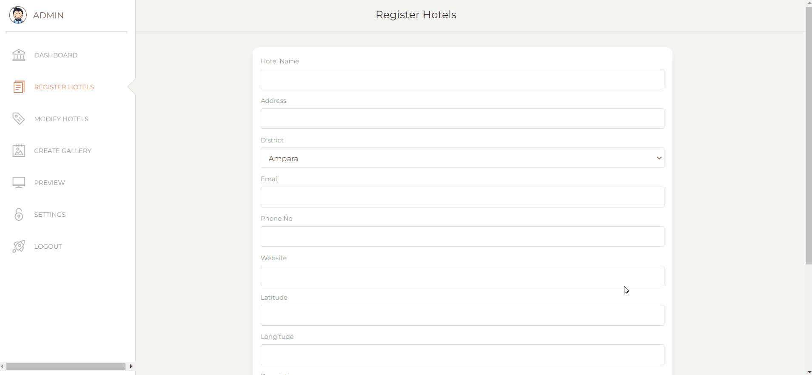
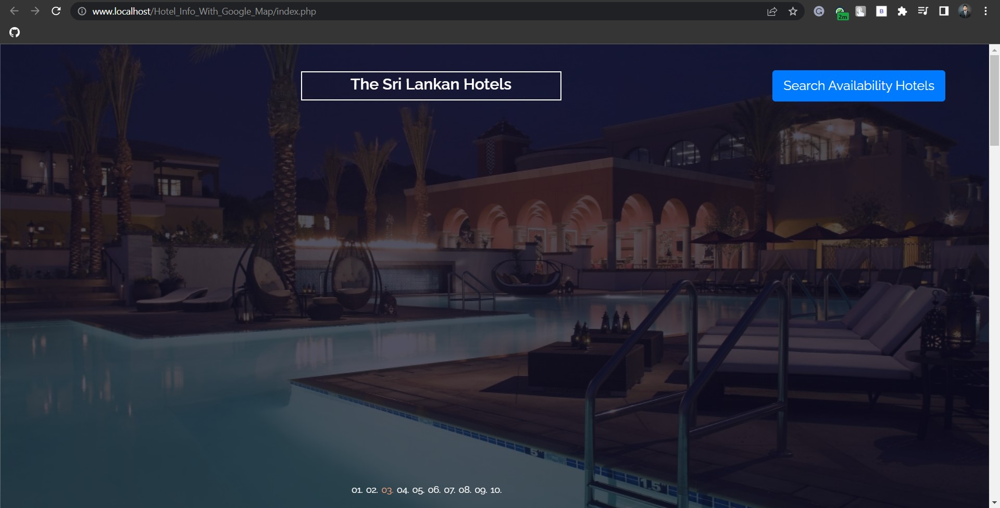
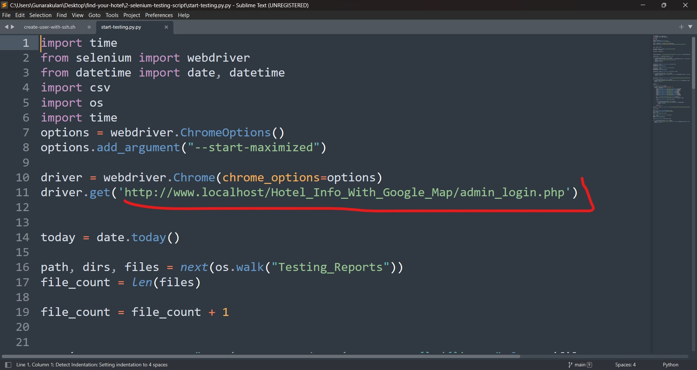

# Find Your Hotel

## Introduction


This project aims to provide a web-based platform to search and find a suitable hotel and restaurant in Sri Lanka, this web portal contains a lot of hotels information those data can be entered using its backend panel. We can filter out hotels and restaurants based on district and division.


## Technology and Frameworks

### Frontend

- HTML 5
- CSS 3
- JavaScript
- jQuery
- Bootstrap 4

### Backend
- PHP
- MySQL


## Directory Structure

- **0-database** : Contains the database of the system.
- **1-soruce**   : Contains source code of the project.
- **2-selenium-testing-scripts**   : Contains testing scripts for the project.

- **github-readme-contents**   : Contains GitHub readme assets.


## Configuration & Setup

**Step 01:** The source code is found on the "1-source" directory, deploy it in a server.

**Step 02:** The database is found on the "0-database" folder, deploy it in a MySQL database engine Ex: phpMyAdmin.

## System Explained

### Website Index Page

This is the front page of the website. It contains some basic information of the online platform.


### Search Page

This page has a filter feature where visitors are able to search and find information of hotels and restaurants in Sri Lanka, the search could used to filter restaurants and hotels based on districts.


### Admin Page

```
http://www.domain-name.com/admin_login.php

```

**Note:** The admin page is hidden, in order to open the admin panel, we have to type **"/admin_login.php"** after the domain name of this platform, an example is shown bellow.

### Admin Login



#### Credentials

- **Username:** guna
- **Password:** kuna123


### Admin Account

This is the admin panel. It contain six modules such as Dashboard, Register Hotels, modify hotels, Cerate Gallery, Preview, Settings, Logout.

- **Dashboard:** Has a simple UI.
- **Register Hotels:** has the function to register hotels.
- **Modify Hotels:** has delete/edit function.
- **Cerate Gallery:** has function to create gallery for registered hotels.
- **Preview:** has function to preview hotel info as visitors.
- **Settings:** has function to change credentials such as password.
- **Logout:** has function to logout.


### Register Hotels Module

**Note:** This page module function to register new hotel to the system database.




### Cerate Gallery Module

**Note:** This module has function create image gallery for registered hotel.


### Preview Module

**Note:** This module will take us to the home page to check the preview.




### Setting Module

**Note:** This module is used to change password of the admin panel.


## Web Testing Scripts Explained

### Introduction

Web testing is a software testing practice to test websites or web applications for potential bugs. It’s a complete testing of web-based applications before making them live.

**Note:** The testing script for this web application is found on the following directory "2-selenium-testing-scripts/start-testing.py", to start the automatic testing run this scripts.

**Note:** The framework, selenium is used to build this testing script with python Programming language.

#### Setup Testing Script

- **Step 01: Install Python**
  - [Download Python](https://www.python.org/)

- **Step 02: Install Selenium**
  - ```pip install selenium```

- **Step 03: Download Latest Driver for Chrome**
  - [Download Chrome Driver](https://chromedriver.chromium.org/downloads)

- **Step 03: Install Pynput**
  - ```pip install pynput```


#### Execute Testing script.

- **Step 01:** The script is found on the following directory.

  ```
  find-your-hotel/2-selenium-testing-scripts/start-testing.py
  ```

- **Step 02:** Edit the URL to the domain (Hosted URL) on line number 11.

  

- **Step 03:** Execute the script.

  ```
  python start-testing.py
  ```

#### Testing script output.


# Contact

### Website: 

[](https://www.gunarakulan.info)

### Social Media:

[](https://www.linkedin.com/in/gunarakulangunaretnam)
[](https://www.facebook.com/gunarakulangunaretnam)
[](https://wa.me/94740001141?text=WhatsApp%3A%20%2B9740001141)
[](https://www.instagram.com/gunarakulangunaretnam)
[](https://x.com/gunarakulangr)
[](https://www.kaggle.com/gunarakulangr)
[](https://www.tiktok.com/@gunarakulangunaretnam)
[](https://www.youtube.com/channel/UCjMOdgHFAjAdBKiqV8y2Tww)
